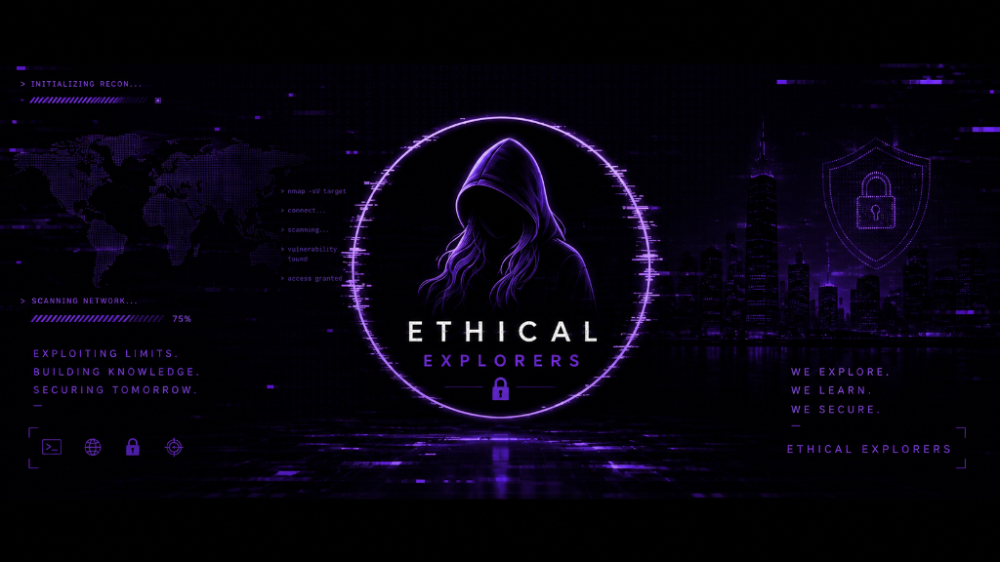

# 🛡️ Ethical Explorers

### 🚀 Cybersecurity Tutorials, Ethical Hacking Guides & Hands-on Labs

---

## 📺 Official YouTube Channel

**[Ethical Explorers](https://youtube.com/@ethicalexplorers18)** is an educational platform dedicated to teaching cybersecurity, ethical hacking methodologies, penetration testing, network defense, and online privacy.

### 🎯 What We Cover
- 💻 **Penetration Testing & Exploitation**: Practical walkthroughs using Kali Linux, Nmap, Metasploit, Burp Suite, and SQLMap.
- 🌐 **Web Security**: Hands-on OWASP Top 10 demonstrations (SQL Injection, XSS, CSRF, LFI, SSTI).
- 🛡️ **Network Defense & Forensics**: Wireshark packet analysis, firewall setup, and intrusion detection.
- 🕵️ **OSINT & Privacy**: Open-source intelligence gathering, digital anonymity, and threat analysis.
- 🧪 **Interactive In-Browser Labs**: 20+ built-in browser sandboxes for safe vulnerability testing without virtual machines.

---

## 🔗 Official Links & Socials

| Platform | Link | Purpose |
|---|---|---|
| 🔴 **YouTube** | [**@ethicalexplorers18**](https://youtube.com/@ethicalexplorers18?sub_confirmation=1) | Video guides, tool walkthroughs & CTF labs |
| 💬 **Telegram** | [**t.me/ethicalexplorers**](https://t.me/ethicalexplorers) | Community alerts, study resources & updates |
| 📸 **Instagram** | [**@ethical_explorers_18**](https://www.instagram.com/ethical_explorers_18) | Security infographics, quick tips & reels |
| ✉️ **Email** | [**ethicalexplorers18@gmail.com**](mailto:ethicalexplorers18@gmail.com) | Business & general inquiries |
| 🌐 **Website** | [**ethicalexplorers.github.io**](https://ethicalexplorers.github.io/) | Articles, video player & interactive sandboxes |

---

## ⚠️ Educational Disclaimer

All content, tutorials, and materials provided by **Ethical Explorers** are strictly for **educational and authorized security testing purposes only**. Always obtain proper authorization before testing any network, website, or system. Unauthorized access is strictly illegal.

---

### 👉 [Subscribe to Ethical Explorers on YouTube](https://youtube.com/@ethicalexplorers18?sub_confirmation=1) 👈

© 2026 Ethical Explorers. All rights reserved.

